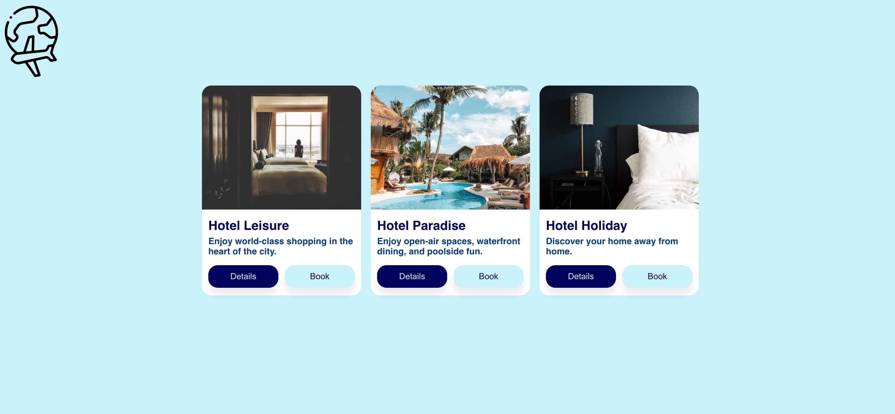

# The Hotel Finder
Link to project deployed with netlify. Live demo [here](https://the-hotel-finder.netlify.app)

## Table of Content
* General Information
* Technologies Used
* Features
* Screenshot
* Installation and Setup Instructions
* Usage
* Project Status
* Room for Improvement
* Acknowledgements
* Contact

## General Information
I created The Hotel Finder to display my skills using CSS-in-JS, a popular technique that allows developers to write CSS code using Javascript. The Hotel Finder website is a static website built with the Emotion library.
### Purpose of this project

To demonstrate the use of CSS-inJS with the Emotion library.

## Technologies Used
* Emotion Library
* ReactJS
* HTML
* CSS-in-JS
* JavaScript

## Features
* Display of skillset in CSS-in-JS with the use of the Emotion Library.

## Screenshot
Version 1.0 

## Installation and Setup Instructions

Clone down this repository. You will need node and `npm` installed globally on your machine.

### Installation:

`npm install`

To Run Test Suite:

`npm test`

To Start Server:

`npm start`

To Visit App:

`localhost:3000/`

## Usage

**Display**

Display what can be accomplished using CSS-in-JS

## Project Status
Project is: Completed

## Room for Improvement
* Make website dynamic.

## Acknowledgements
* Many thanks to Codecademy.

## Contact
Created by Abeer Ahmed [LinkedIn profile](https://www.linkedin.com/in/abeerdev/) - feel free to contact me.

